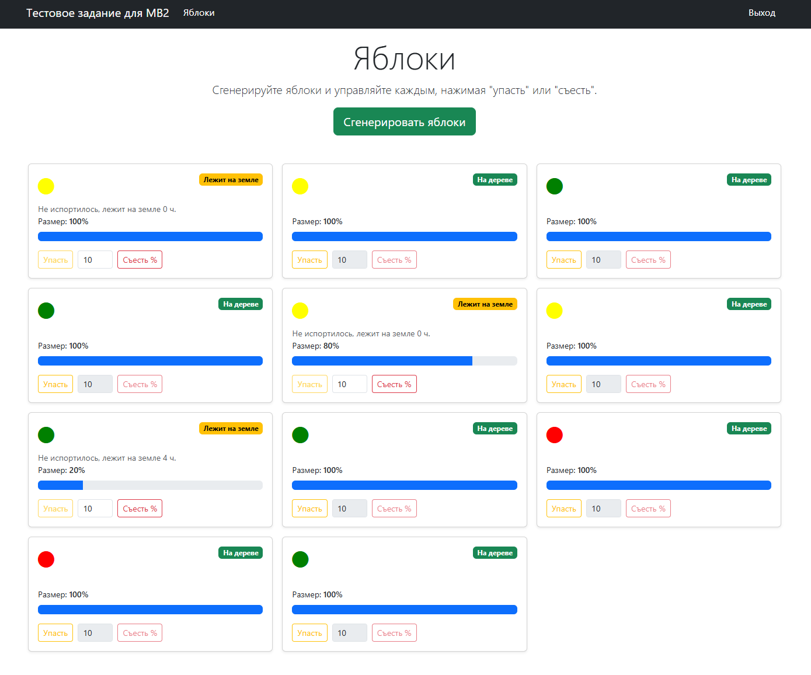

Тестовое задание
-------------------

[Источник](https://docs.google.com/document/d/1XgSKkfZ7aXSBOB3WrOF9PrK1irFd2FU3w7KqfyPm6PQ/edit?tab=t.0#heading=h.gjdgxs)

---



---

Данное решение - не идеальный эталон, а осознанно упрощённая версия боевого подхода, сделанная с прицелом на возможность дальнейшего развития. При необходимости архитектура безболезненно масштабируется как по функциональности, так и по организационной структуре проекта.

## Допущения и упрощения

В рамках тестового задания я сознательно допустил ряд упрощений. В боевом проекте такие моменты я бы предварительно обсудил с командой и заказчиком, так как они напрямую влияют на масштабируемость, поддержку и развитие решения.

### Отказ от i18n

- Интерфейс и сообщения реализованы только на русском языке.
- Это сделано для снижения объёма кода и фокуса на бизнес-логику.
- В боевой версии все пользовательские строки я бы вынес в систему локализации.

### JS размещён непосредственно во view

- Весь JavaScript-код намеренно оставлен внутри site/index.php.
- Это упрощает восприятие тестового задания и уменьшает количество файлов.
- В боевом проекте JS был бы вынесен в отдельные asset-бандлы или фронтенд-сборку.

### Отсутствие автоматических тестов

- Тесты намеренно не писал, чтобы не раздувать объём задания.
- В реальном проекте я бы в первую очередь покрыл unit-тестами сервисы и ключевую бизнес-логику, а затем добавил интеграционные и функциональные тесты.

### Отсутствие модульной декомпозиции

- Проект не разбит на отдельные модули.
- Это сделано сознательно, так как логика задания компактная.
- При росте проекта логика была бы разнесена по модулям с чёткими границами ответственности.

### Минимальная сборка докера

- Взяты стандартные `Dockerfile` и `docker-compose.yml`, которые давал Yii2. В них добавлены минимальные изменения. 

---
## Немного о структуре и архитектуре проекта

При проектировании структуры я опирался на подходы, которые использую в реальных коммерческих проектах. Ниже - пояснение логики, которой я руководствовался.

### ActiveRecord-модели сделаны тонкими

- Они отвечают только за работу с таблицами БД: структуру, базовую валидацию и преобразование в DTO. Бизнес-логика в моделях отсутствует.

### Работа с БД инкапсулирована в репозиториях

- Прямые обращения к ActiveRecord разрешены только в репозиториях. Доступ к данным осуществляется через DTO, что упрощает контроль изменений и снижает связанность.

### DTO иммутабельные

- Все DTO неизменяемы, что упрощает понимание состояния объекта и снижает риск побочных эффектов.

### Основная логика реализована в сервисах без состояния

- Сервисы принимают входные данные, выполняют бизнес-логику и возвращают результат в виде DTO.
- Несмотря на наличие класса Apple (ActiveRecord), поведение объекта определяется именно сервисами.

### `frontend` / `backend` / `console` — тонкие клиентские слои

- Эти приложения не работают напрямую с БД и не содержат бизнес-логики. Они лишь оркестрируют вызовы сервисов.

### Вся бизнес-логика вынесена в common

- Взаимодействие с доменной частью происходит исключительно через интерфейсы из public_services и public_interfaces.

### Публичные интерфейсы используются как контракты

- Они оперируют только DTO и скалярными типами и не зависят от инфраструктуры.
- Такой подход упрощает возможный переход к микросервисной архитектуре.

### Гибкость под регламенты команды

- Архитектура не догматична. При наличии других стандартов или подходов адаптация не представляет сложности.

---

## Инструкция по развертыванию проекта локально

### 1. Установить Docker и Docker Compose

Для работы с проектом локально необходимо установить Docker и Docker Compose.

Проект был развернут успешно на следующей конфигурации:

- Docker version 28.0.4
- Docker Compose version v2.34.0

Скорее всего запустится и на других версиях.

Docker Compose обязательно дложен быть не ниже 2 версии.

### 2. Скопировать проект из Github

В первую очередь:

- добавить свой SSH-ключ в Github

!!! ВАЖНО !!!

Если у вас винда, то ПЕРЕД клонированием репозитория нужно сделать такую настройку обработки конца строк:

```bash
git config --global core.autocrlf input
```

* [https://github.com/zzeraw/test-app-mb2](https://github.com/zzeraw/test-app-mb2)

Склонируйте код в папку проекта:

```bash
git clone git@github.com:zzeraw/test-app-mb2.git
```

Переходим в папку проекта:

```bash
cd test-app-mb2
```

Нужно создать файл с .env-переменными, скопировав файл-образец:

```bash
cp .env.dist .env
```

Или вручную скопируйте содержимое файла `.env.dist` в файл `.env`.

Пропишите в файле `.env` актуальные авторизационные данные. По умолчанию все уже прописано.

### 3. Сборка и запуск проекта в Docker

Собираем образы Docker:

```bash
docker compose build
```

Запускаем сервисы:

```bash
docker compose up -d
```

### 4. Запуск проекта, установка зависимостей Composer, запуск миграций

Зависимости и миграции можно запустить вручную, зайдя внутрь контейнера:

```bash
docker compose exec backend bash

composer install
php yii migrate/up
```

Либо без явного захода в контейнер:

```bash
docker compose exec backend composer install
docker compose exec backend php yii migrate/up
```

Строка для локального клиента БД: `jdbc:mysql://localhost:33061/testappmb2`.

Устанавливаем права на директории:

```bash
docker compose exec backend bash

cd /app
chmod -R 777 backend/web/assets
chmod -R 777 frontend/web/assets
chmod -R 777 backend/runtime
chmod -R 777 console/runtime
chmod -R 777 frontend/runtime
```

### 5. Создание пользователя

Заходим в контейнер:

```bash
docker compose exec backend bash

php yii user/create test@test.com password
```

Скрипт автоматически создаст пользователя с указанными данными.

### 6. Запуск проекта в браузере

- Админская часть: [http://localhost:21080](http://localhost:21080)
- Клиентская часть: [http://localhost:20080](http://localhost:20080)